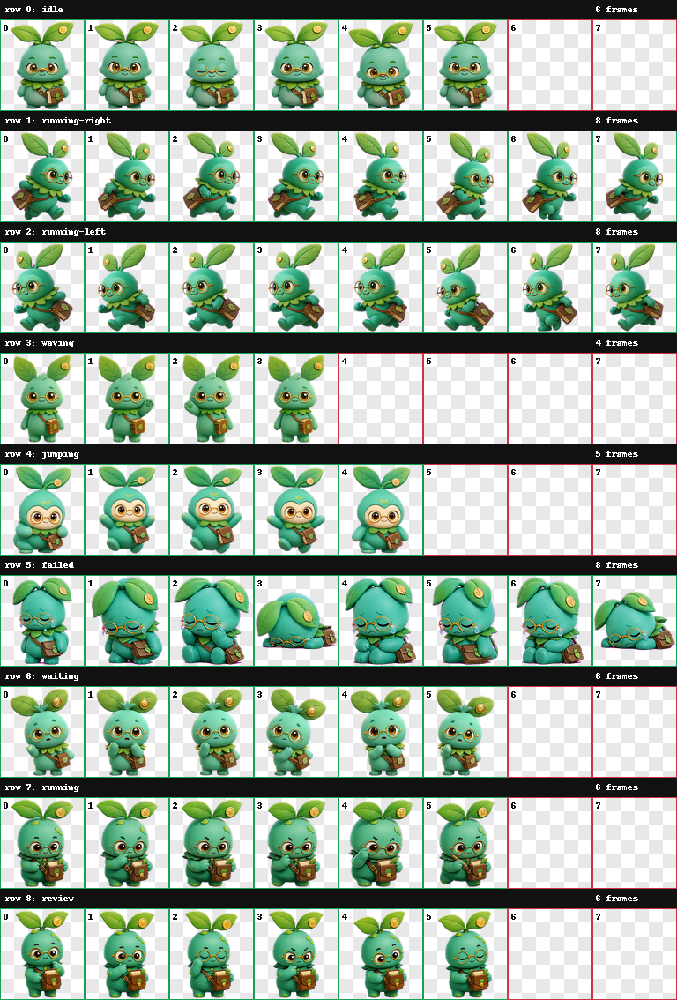

# Market Sprout Codex Pet

Market Sprout 是一只面向 Codex 的双语研究助手宠物：以绿色幼芽为主体，佩戴圆框眼镜和随身笔记本，整体风格温和、专注，带一点金融研究气质。



## 资源规格

- Codex Pet spritesheet v2
- 图片格式：透明背景 WebP
- 图集尺寸：`1536 × 1872`
- 网格尺寸：`8 列 × 9 行`
- 单帧尺寸：`192 × 208`
- 验证状态：通过，零错误、零警告

## 动画状态

| 行 | 状态 | 帧数 | 用途 |
| --- | --- | ---: | --- |
| 1 | `idle` | 6 | 待机、呼吸与眨眼 |
| 2 | `running-right` | 8 | 向右移动 |
| 3 | `running-left` | 8 | 向左移动 |
| 4 | `waving` | 4 | 打招呼或吸引注意 |
| 5 | `jumping` | 5 | 跳跃与活跃反馈 |
| 6 | `failed` | 8 | 失败、受阻或取消 |
| 7 | `waiting` | 6 | 等待确认或用户输入 |
| 8 | `running` | 6 | 执行任务 |
| 9 | `review` | 6 | 完成并等待查看结果 |

## 目录结构

```text
hatch-pet-market-sprout/
├── final/
│   ├── spritesheet.webp   # 可交付动画图集
│   └── validation.json    # 尺寸、透明度和逐帧校验结果
├── qa/
│   ├── contact-sheet.png  # 全状态预览
│   ├── previews/          # 各状态 GIF 预览
│   ├── review.json
│   └── run-summary.json
└── pet_request.json       # 角色设定与动画规格
```

## 使用

集成时使用 `final/spritesheet.webp`，并按照 `pet_request.json` 中的行号和帧数读取动画。若要人工检查各状态，可直接查看 `qa/previews/` 下的 GIF。

## 说明

本仓库主要保存生成结果、验证记录和 QA 预览，不包含宠物运行时或安装器。
